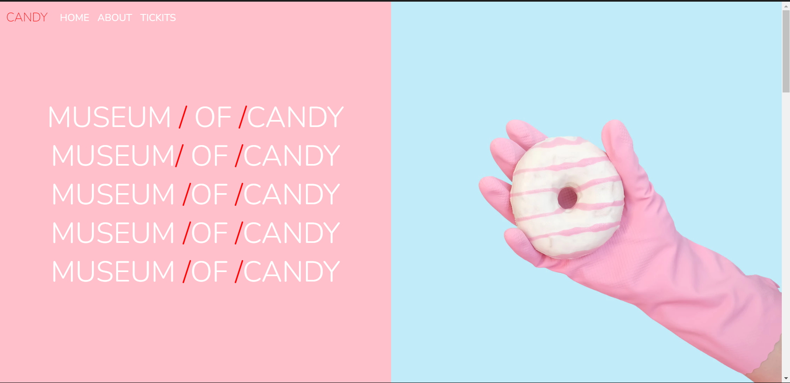

# Project Title

A Siple webiste with Candy .

## Table of Contents

- [Project Overview](#project-overview)
- [Features](#features)
- [Technologies Used](#technologies-used)
- [Screenshot](#screenshot)

## Project Overview

Task that show you how build a design with bootstrap.

## Features

- Feature 1: Show you how easly make two div and can swap between them.

## Technologies Used

- Css: For building the user interface.
- Bootstrap: For styling the UI.

## Screenshot 

